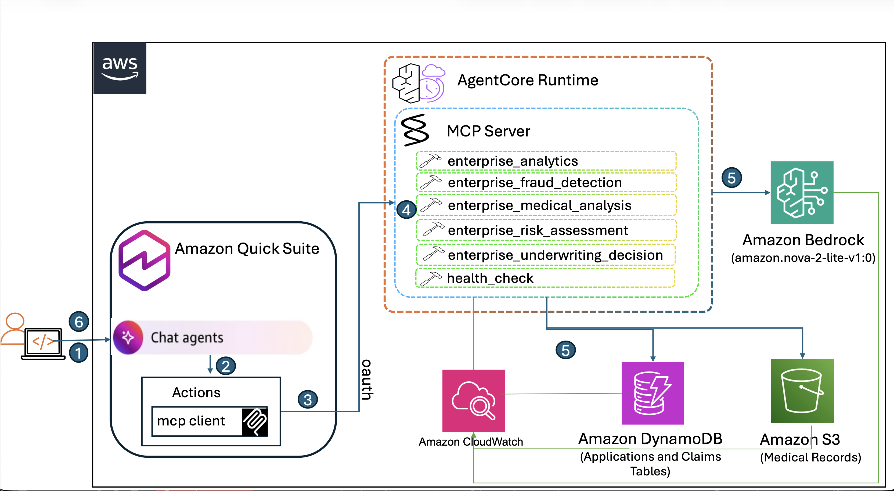

# Amazon Nova Lite 2.0 Enterprise Insurance Underwriting

An MCP server demonstrating **Amazon Nova Lite 2.0's deep reasoning capabilities** for insurance underwriting with transparent, explainable AI decisions.

## 🎯 Overview

This enterprise-grade solution demonstrates how to build an intelligent insurance underwriting system using:
- **Amazon Nova Lite 2.0** for transparent AI reasoning and explainable decisions
- **Amazon Bedrock AgentCore** for scalable MCP server deployment
- **Enterprise data integration** with 1000+ synthetic applicants and 500+ claims
- **Regulatory compliance** through complete audit trails and reasoning transparency

## 🏗️ Architecture



## 📁 Project Structure

```
smart_insurance_agent/
├── deployment/                      # Deployment and configuration
│   ├── deploy_mcp.py                # Main deployment script (create/update MCP server)
│   ├── deploy.sh                    # Deployment launcher with cache clearing
│   ├── load_data.py                 # Generate and load synthetic data to DynamoDB/S3
│   ├── mcpserver.py                 # MCP server with 6 enterprise tools
│   ├── config_manager.py            # Configuration loader from enterprise_config.yaml
│   ├── generate_agentcore_config.py # Generate AgentCore YAML configuration
│   ├── requirements.txt             # Python dependencies (deployment + testing)
│   ├── cleanup.py                   # Remove all AWS resources
│   ├── Dockerfile                   # Container image for AgentCore deployment
│   └── .dockerignore                # Docker build exclusions
│
├── config/                          # Configuration files
│   ├── enterprise_config.yaml       # Main configuration (customize before deployment)
│   ├── bedrock_agentcore_nova.yaml  # AgentCore configuration template
│   └── Dockerfile                   # Alternative Dockerfile location
│
├── docs/                            # Auto-generated documentation
│   └── QUICK_SUITE_INTEGRATION.md   # OAuth credentials and Quick Suite setup
│
├── tests/                           # Testing and validation
│   └── test_mcp_functionality.py    # Comprehensive tool and functional tests
│
├── smart_insurance_agent_venv/      # Python virtual environment
├── sample_applicants.json           # Sample applicant data (auto-generated)
├── sample_medical_records.json      # Sample medical records (auto-generated)
└── README.md                        # This file
```

## 🚀 Quick Start

### Prerequisites
- AWS CLI configured with Bedrock permissions
- Python 3.12+
- Access to Amazon Bedrock Nova Lite 2.0 model

### STEP 1: Clone and Setup Environment
```bash
git clone git@github.com:aws-samples/sample-quicksuite-chatagent-insurance-underwriting.git
cd sample-quicksuite-chatagent-insurance-underwriting

# Create virtual environment and install dependencies
python -m venv smart_insurance_agent_venv
source smart_insurance_agent_venv/bin/activate  # Linux/Mac
pip install -r deployment/requirements.txt
```

### STEP 2: Configure AWS Resources to be created in this deployment
Before deployment, customize all parameters in `config/enterprise_config.yaml`:

```bash
# Edit configuration file
vim config/enterprise_config.yaml
```

```yaml
# Nova Lite 2.0 Enterprise Insurance Configuration
# Customize resource names for your deployment

# DynamoDB Configuration - Customize table names
dynamodb:
  applicants_table: "your-company-applicants-table"     # e.g., "acme-insurance-applicants"
  claims_table: "your-company-claims-table"             # e.g., "acme-insurance-claims"

# S3 Configuration - Customize bucket name (must be globally unique)
s3:
  bucket_name: "your-company-insurance-{account_id}"    # e.g., "acme-insurance-{account_id}"
  medical_records_prefix: "medical-records"             # Folder structure in S3

# AgentCore Configuration - Customize MCP server identity
agentcore:
  mcp_server_name: "your_company_mcp_server"            # e.g., "acme_insurance_mcp_server"
  cognito_user_pool_name: "your-company-cognito-pool"   # e.g., "acme-insurance-auth-pool"
  oauth_api_identifier: "your-company-api-identifier"   # e.g., "acme-insurance-api"

# AWS Configuration
aws:
  region: "us-east-1"  # Change to your preferred region for AgentCore and Quick Suite

# Nova Model Configuration - AI reasoning parameters
nova:
  model_id: "amazon.nova-2-lite-v1:0"                  # Nova model version
  inference_config:
    temperature: 0.3            # Low temperature for consistent, focused responses (0.0-1.0)
    topP: 0.9                   # High top-p for diverse but relevant reasoning (0.0-1.0)
    maxTokens: 10000            # Allow long responses for detailed reasoning (1-10000)
    maxReasoningEffort: "low"   # Cost-optimized reasoning effort (low/medium/high)
```

**Important Notes:**
- **S3 bucket names must be globally unique** across all AWS accounts
- **Use your company/project prefix** to avoid naming conflicts
- **Resource names will be created automatically** during deployment
- **All resources use the same region** specified in the config


### STEP 3: Load Enterprise Data

```bash
# Generate and load 1000+ synthetic applicants and claims
python deployment/load_data.py
```

**What gets generated and loaded:**

#### Synthetic Data Generation
- **1000+ Insurance Applicants** - Complete profiles with demographics, health data, and risk factors
- **500+ Insurance Claims** - Medical, auto, and life insurance claims with fraud indicators
- **1000+ Medical Records** - Detailed health histories, treatments, and chronic conditions (one per applicant)

#### Data Storage Destinations
- **DynamoDB Tables:**
  - `{applicants_table}` - Applicant profiles (age, income, health status, occupation, etc.)
  - `{claims_table}` - Claims data (amounts, types, fraud indicators, approval status)
- **S3 Bucket:**
  - `{bucket_name}/{medical_records_prefix}/` - Medical records as JSON files
  - Individual files: `APP-XXXX/summary.json` for each applicant

#### Sample Data Includes
- **Demographics:** Age, gender, marital status, occupation, income
- **Health Data:** BMI, smoking status, chronic conditions, family history
- **Risk Factors:** Previous claims, credit scores, lifestyle indicators
- **Claims History:** Claim amounts, types, dates, fraud scores
- **Medical Records:** Diagnoses, treatments, hospitalizations, medications

**Note:** All data is synthetic and generated using the Faker library for realistic but non-sensitive testing data.

### STEP 4: Deploy MCP Server

#### First-Time Deployment
For new deployments, the script will create all AWS resources:

```bash
# Deploy to Bedrock AgentCore with authentication
./deployment/deploy.sh
```

**What gets created on first deployment:**
- ✅ Cognito User Pool for OAuth authentication
- ✅ Cognito Domain for token endpoint
- ✅ OAuth Client with client_credentials flow
- ✅ AWS Secrets Manager secret for OAuth credentials
- ✅ IAM execution role with DynamoDB, S3, and Bedrock permissions
- ✅ AgentCore runtime with Docker container
- ✅ ECR repository for container images
- ✅ Quick Suite integration documentation

#### Update Existing Deployment
For code updates to existing servers, the script will detect the existing deployment:

```bash
# Same command - script auto-detects existing deployment
./deployment/deploy.sh
```

**When prompted "Do you want to update the existing server? (y/n):", choose:**
- **`y`** - Update server code only (preserves all AWS resources)
- **`n`** - Cancel deployment

**What gets updated:**
- ✅ MCP server code and Docker container
- ✅ IAM permissions (ensures latest policies)
- ✅ AgentCore runtime configuration
- ⚠️ **Preserved:** Cognito, OAuth credentials, IAM roles

#### Deployment Modes Summary
| Mode | Trigger | Resources Created | Resources Preserved | Use Case |
|------|---------|-------------------|--------------------|-----------|
| **New** | No existing server found | All resources | None | Initial setup |
| **Update** | Existing server detected + user confirms | Code only | All AWS resources | Code changes |

### STEP 5: Test MCP Server

```bash
# Comprehensive validation of MCP tools and functionality
python tests/test_mcp_functionality.py
```

**What the test validates:**

#### Infrastructure Tests
- ✅ **AgentCore Runtime Connection** - Verifies MCP server is accessible
- ✅ **OAuth Authentication** - Tests Cognito JWT token generation
- ✅ **Sample Data Retrieval** - Confirms DynamoDB tables have test data

#### MCP Tools Validation (6 Tools)
- 🔍 **health_check** - Server health status and data source connectivity
- 📊 **enterprise_risk_assessment** - Risk assessment with Nova reasoning
- 🏥 **enterprise_medical_analysis** - Medical records analysis
- 🔍 **enterprise_fraud_detection** - Fraud detection analysis
- ⚖️ **enterprise_underwriting_decision** - Complete underwriting decision
- 📈 **enterprise_analytics** - Portfolio analytics

#### Functional Tests (End-to-End Scenarios)
- 🎯 **Risk Assessment with Reasoning** - Tests Nova's step-by-step analysis
- 🏥 **Medical Analysis** - Validates medical record processing
- ⚠️ **Fraud Detection** - Tests claim fraud pattern recognition
- ⚖️ **Underwriting Decision** - Complete policy approval workflow
- 📊 **Portfolio Analytics** - Business intelligence reporting

**Expected Output:**
```
📊 TEST SUMMARY:
   ✅ Successful: 6/6 tools
🎉 All tools working perfectly!
✅ MCP server is production-ready for Quick Suite integration
```

### STEP 6: Cleanup (After Testing)

**Purpose:** Remove all AWS resources created during deployment to avoid ongoing charges

```bash
# Remove all AWS resources to avoid charges
python ./deployment/cleanup.py
```

**AWS Resources that will be deleted:**

#### AgentCore Resources
- 🗑️ **MCP Server Runtime** - Bedrock AgentCore runtime instance

#### Authentication Resources
- 🗑️ **Cognito User Pool** - OAuth authentication pool
- 🗑️ **Cognito Domain** - Token endpoint domain
- 🗑️ **OAuth Client** - Service-to-service client credentials
- 🗑️ **Secrets Manager Secret** - Stored OAuth credentials

#### Data Storage Resources
- 🗑️ **DynamoDB Tables** - Applicants and claims tables (with all data)
- 🗑️ **S3 Bucket** - Medical records storage (with all files)

#### IAM Resources
- 🗑️ **AgentCore Runtime Role** - MCP server execution permissions (auto-created by AgentCore)
- 🗑️ **Inline IAM Policies** - DynamoDB, S3, and Bedrock access policies attached to runtime role
- 🗑️ **Managed Policy Attachments** - Any AWS managed policies attached to the role

**⚠️ Warning:** This action is irreversible. All data and configurations will be permanently deleted. Only run cleanup after completing your testing and evaluation.


## 🔗 Quick Suite Integration

After deployment, connect to Amazon Quick Suite for natural language business queries:

### Connection Details (Auto-generated)
The deployment script creates `docs/QUICK_SUITE_INTEGRATION.md` with actual values:
- MCP Server Endpoint
- Client ID and Token URL
- Authentication configuration
- Sample queries and troubleshooting

### Sample Quick Suite Integration Queries

**Risk Assessment & Underwriting:**
- "Assess risk for applicant APP-0001 - analyze their health status, BMI, and smoking history"
- "What's the risk profile for applicants with BMI over 30 and previous claims above 3?"
- "Show me applicants with Poor health status who are smokers with family history of diabetes"
- "Compare risk scores between Software Engineers, Doctors, and Sales Reps in our portfolio"
- "Which applicants over age 60 have Excellent health status and no previous claims?"

**Medical Underwriting:**
- "Analyze medical records for APP-0100 - check for chronic conditions and hospitalizations"
- "Find applicants with Hypertension in chronic conditions and cholesterol over 250"
- "Which applicants have 2 or more hospitalizations and take multiple medications?"
- "Review all chronic conditions in our portfolio - what's our diabetes and heart disease exposure?"
- "Show applicants with blood pressure over 160/100 and BMI over 32"

**Claims & Fraud Detection:**
- "Investigate claim CLM-0050 - analyze fraud indicators and claim timing"
- "Show all claims with fraud indicators above 3 and status Under Investigation"
- "Which claims were filed within 30 days of policy start date?"
- "Compare fraud patterns: Auto Accident vs Medical vs Property Damage claims"
- "Find Approved claims over $75,000 - justify these high-value approvals"

**Portfolio Analytics:**
- "What's our overall portfolio health distribution across Excellent, Good, Fair, and Poor categories?"
- "Show claim approval rates by type: Auto Accident, Medical, Property Damage, Life, Disability"
- "Which occupations have the highest average previous claims: Teachers, Nurses, or Managers?"
- "Analyze income vs credit score correlation for applicants with 0 previous claims"
- "What percentage of our applicants are smokers with Fair or Poor health status?"

**Underwriting Decisions:**
- "Should we approve APP-0500 for life insurance - consider age, health status, and smoking?"
- "Make underwriting decision for APP-0750 with 4 previous claims and Poor health status"
- "What premium adjustment for applicants with diabetes in chronic conditions?"
- "Compare underwriting recommendations: Married vs Single applicants over age 50"
